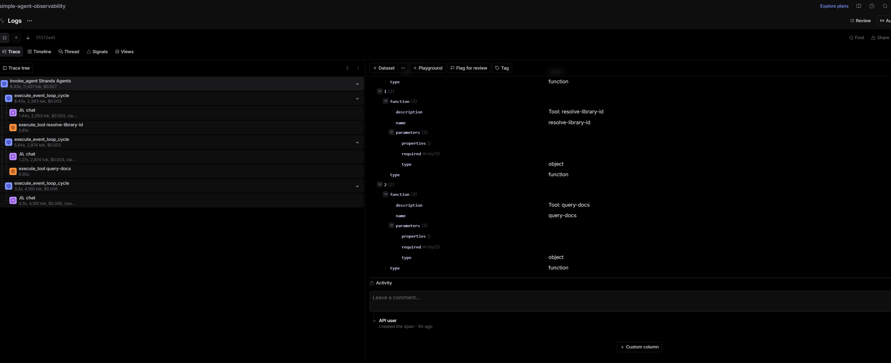

# MCP Analysis

- Connected to Context7 at https://mcp.context7.com/mcp
- Loaded 2 tools: resolve-library-id and query-docs

The trace has 3 steps:
    - 1: called resolve-library-id  to find FastAPI's library ID
    - 2: called query-docs to fetch FastAPI documentation
    - 3: generated the final answer using the docs
The total metric are: 8.43s, 11431 tokens, $0.027
