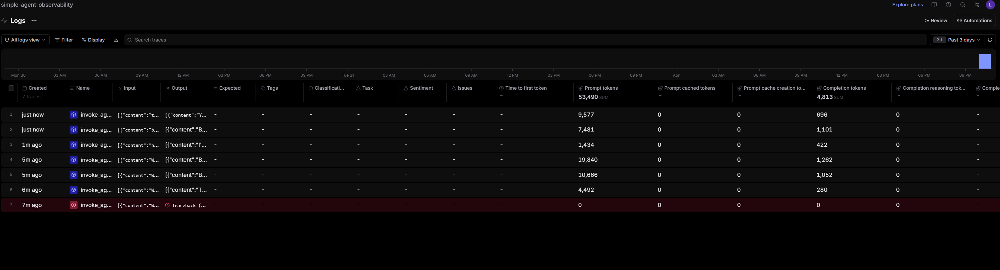
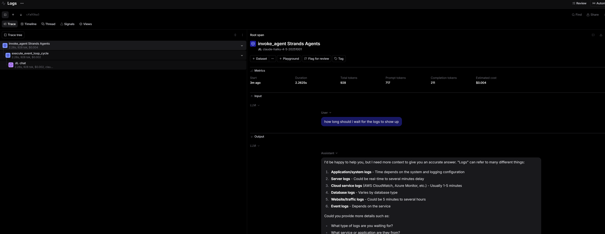
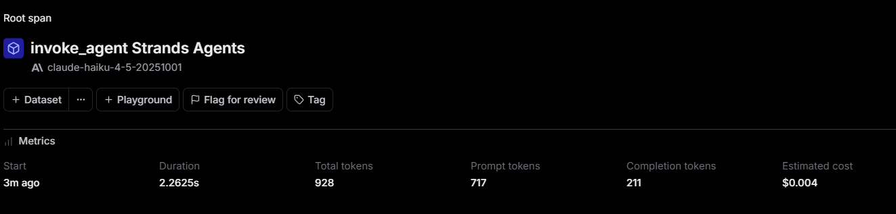

# Analysis

## Braintrust Logs Overview

The Logs tab shows 6 successful traces captured over the past tries and a failed one which occured during my first no question run. Each row represents one agent invocation. 

The total prompt tokens is 53490 and total completion tokens is 4813. Different traces vary significantly in token usage one trace used 10666 prompt tokens while another used only 1434. This shows the different complexity of each query and how much DuckDuckGo search content was returned. 

## Trace Detail View

Here is the detail of a single trace clicked. Agents was running on claude-haiku-4-5-20251001. Under it there are child spans. The cycle is where the agent decides whether to call a tool or generate output, and the ai span captures the actual LLM call. This makes it easy to see exactly which step took the most time or there could be potential issues for debugging.

## Metrics

The metrics of the selected trace are: Duration of 2.2625s, Total tokens of 928 with 717 prompt tokens and 211 completion tokens, and an estimated cost of $0.004. The prompt tokens are higher than completion tokens. This was because the prompt includes the system prompt, the user question, and the DuckDuckGo search results. 
